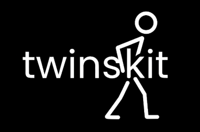

<p align="center">
  
</p>

<h1 align="center">TwinSLKit</h1>

<p align="center">
Plataforma de comunicação em tempo real inspirada em apps de comunidade: texto, voz, mídia e organização por servidores/canais como o Discord.
</p>

## 📚 Documentação

- Documentação para deploy:
  - https://liberating-flyaway-665.notion.site/TwinSLKit-Documentation-311fc24db26d8030bf94e08e30f1e432?pvs=74a

## ✨ Funcionalidades

- Servidores com canais de texto e voz
- Mensagens em canais e DM
- Upload de arquivos e mídia
- Moderação (ban, ações de voz (expulsar, mover, silenciar, permissões)
- Usar audios durante a chamada
- Ouvir musicas sem bots
- Integração com LiveKit (voz/câmera/tela)
- Proteção anti-bot no login/cadastro com Cloudflare Turnstile
- Auditoria Logs
- E muito mais...

## 🧱 Stack

- Next.js 16 (App Router) + React 19 + TypeScript
- Prisma + PostgreSQL
- LiveKit (client + server SDK)
- Tailwind CSS

## ✅ Requisitos

- Node.js 20+
- PostgreSQL
- Projeto/instância LiveKit

## 🚀 Rodando localmente

1. Instale as dependências:

```bash
npm install
```

2. Copie o arquivo de ambiente:

```bash
cp .env.example .env.local
```

3. Ajuste as variáveis no `.env.local` (banco, LiveKit e Turnstile).

4. Gere cliente Prisma e sincronize schema:

```bash
npm run db:generate
npm run db:push
```

5. Inicie em desenvolvimento:

```bash
npm run dev
```

Acesse: `http://localhost:3000`

## 🔐 Variáveis de ambiente importantes

- `DATABASE_URL`
- `LIVEKIT_URL`
- `NEXT_PUBLIC_LIVEKIT_URL`
- `LIVEKIT_API_KEY`
- `LIVEKIT_API_SECRET`
- `NEXT_PUBLIC_ENABLE_TURNSTILE`
- `NEXT_PUBLIC_TURNSTILE_SITE_KEY`
- `TURNSTILE_SECRET_KEY`

Consulte o template completo em [.env.example](.env.example).

## 📦 Scripts

- `npm run dev` — ambiente de desenvolvimento
- `npm run build` — build de produção
- `npm run start` — inicia build de produção
- `npm run lint` — lint do projeto
- `npm run db:generate` — gera cliente Prisma
- `npm run db:push` — sincroniza schema no banco


## 📄 Licença

Este projeto usa licença customizada para uso pessoal e não comercial.
Veja [LICENSE](LICENSE).

